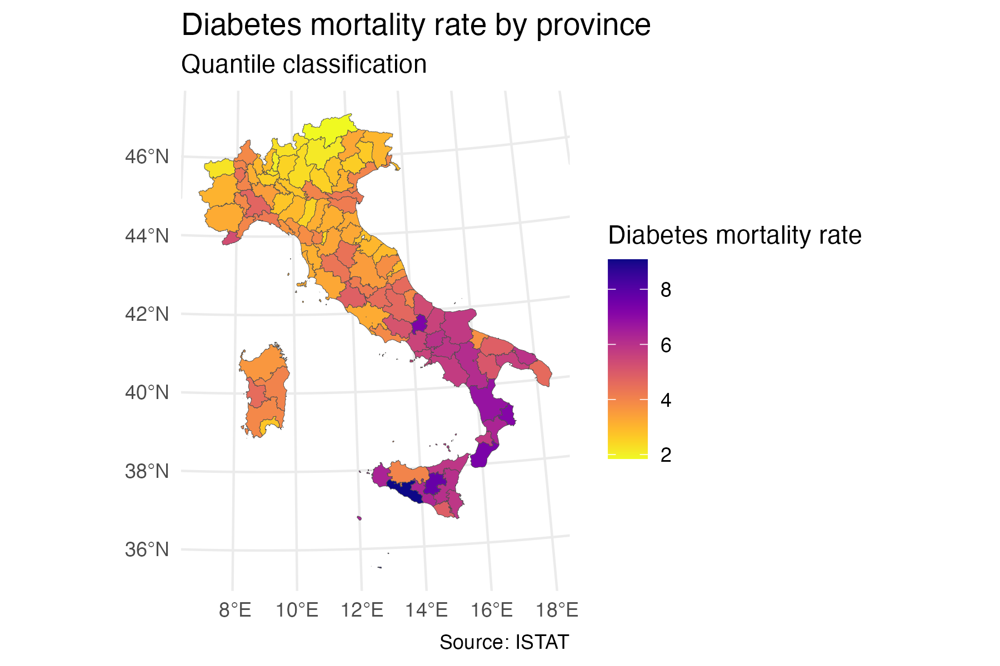

# Geospatial Project: Diabetes Mortality in Italy

Final project for the course *Geospatial Analysis and Representation for Data Science*.

## Project Goal
This project analyzes spatial patterns of diabetes mortality across Italian provinces and explores socio-demographic and lifestyle correlates using descriptive maps, spatial autocorrelation diagnostics, and spatial regression models.

## Repository Structure
```text
geospatial-project2/
|-- scripts/
|   |-- 01_data_cleaning.R
|   |-- 02_descriptive_analysis.Rmd
|   |-- 03_Moran's_I_.Rmd
|   |-- 04_univariate_regressions.Rmd
|   `-- 05_spatial_regression.Rmd
|-- outputs/
|   |-- diabetes_mortality_rate.png
|   |-- lisa_clusters_diabetes.png
|   |-- moran_scatter_diabetes.png
|   |-- pct_65+.png
|   |-- unemployment_rate.png
|   |-- low_education_share.png
|   |-- adequate_nutrition.png
|   `-- sedentariness.png
|-- docs/
|   |-- interactive_map.html
|   `-- interactive_map_files/
|-- data_clean/
|   |-- provinces_base.rds
|   |-- provinces_mortality.rds
|   |-- provinces_mortality_ageing.rds
|   |-- provinces_plus_education.rds
|   |-- provinces_full.rds
|   `-- provinces_prov_level.rds
|-- data_raw/
|   `-- provinces_shapefiles/
|-- geospatial-project2.Rproj
`-- README.md
```

## How The Analysis Was Conducted
The analysis followed a pipeline that goes from data preparation to model-based spatial interpretation. The central idea is that diabetes mortality is not only related to local characteristics of each province, but can also be affected by neighboring provinces through spatial spillovers.

### 1. Data Cleaning and Integration
In `scripts/01_data_cleaning.R`, raw administrative boundaries and province-level indicators were cleaned and merged into a harmonized geospatial dataset. During this phase, variable names were standardized, key geographic identifiers were aligned across sources, and output objects were saved in `data_clean/` to make the subsequent scripts reproducible and modular.

The cleaned dataset includes the mortality outcome together with explanatory factors used later in the regressions:
- `pct_65plus` (population ageing)
- `unemployment_rate`
- `low_education_share`
- `adequate_nutrition`
- `sedentariness`

### 2. Descriptive Spatial Exploration
In `scripts/02_descriptive_analysis.Rmd`, the project first explores distribution and geographic heterogeneity through choropleth maps. This stage is used to identify broad territorial patterns before estimating any model.

The interactive map allows visual comparison across provinces:
- Interactive map (HTML): [https://chiarabel.github.io/geospatial-project-diabetes/interactive_map.html](https://chiarabel.github.io/geospatial-project-diabetes/interactive_map.html)

## Descriptive Analysis
### Diabetes Mortality Map


### Descriptive Findings Summary
The descriptive evidence shows a clear territorial pattern in diabetes mortality. Rates are generally higher in Southern Italy (and in some Central provinces) and lower in much of the North. The observed range is wide, with the highest province (Agrigento, 9.08 per 10,000) far above the lowest (Bolzano, 1.85 per 10,000), indicating strong territorial inequality.

Age structure varies substantially across provinces, but the geography of ageing does not perfectly overlap with the geography of mortality. This suggests that population ageing is important, but not sufficient on its own to explain provincial differences in mortality.

Socio-economic and behavioural indicators show a more consistent spatial alignment with the mortality gradient. In particular, unemployment displays a strong North-South divide, with much higher values in Southern provinces. Low education (measured at regional level), lower adequate nutrition, and higher sedentariness also cluster more in Southern areas, pointing to a broader structural and lifestyle context associated with higher mortality.

Overall, the descriptive stage supports the need for spatial modelling: the outcome and its potential determinants are geographically structured, and the same territorial divide appears across multiple domains.

### 3. Spatial Autocorrelation Diagnostics
In `scripts/03_Moran's_I_.Rmd`, the analysis tests whether similar mortality values cluster geographically. Global Moran's I is used to evaluate overall spatial dependence, while local indicators (LISA) are used to detect province-level clusters and potential spatial outliers.

This step is important because significant spatial autocorrelation implies that standard non-spatial assumptions are not fully appropriate. It motivates moving from purely aspatial models toward specifications that explicitly incorporate neighborhood structure.

Using queen contiguity weights, Global Moran's I for diabetes mortality is `0.6805`, indicating strong positive spatial autocorrelation. The null of spatial randomness is rejected both by the analytical randomisation test (`p < 2.2e-16`) and by Monte Carlo permutations (`p = 0.001`).

LISA confirms that spatial dependence is territorially concentrated rather than uniform: a High-High cluster is observed in Southern Italy, while a Low-Low cluster appears in the North. A Low-High outlier is also detected in Sicily. Overall, these results are consistent with the descriptive North-South mortality gradient and support the use of spatial regression models.

### 4. Regression Phase
In `scripts/04_univariate_regressions.Rmd`, the project runs initial regression checks to understand one-by-one associations and directionality of effects. These baseline results are then extended in `scripts/05_spatial_regression.Rmd`, where spatially informed models are estimated.

### 5. SLX Model and Interpretation Strategy
The Spatial Lag of X (SLX) framework includes:
- local covariates (province characteristics)
- spatial lags of covariates (neighboring provinces' characteristics)

This allows separate interpretation of:
- direct local associations
- indirect neighborhood spillovers

Substantively, this means a province's mortality level can be linked both to its own socioeconomic profile and to the profile of nearby provinces.

## Spatial Lag of X (SLX) Model Results
|  | OLS | SLX |
|---|---:|---:|
| **Local effects (`beta`)** |  |  |
| `pct_65plus` | 0.180*** | 0.214*** |
| `unemployment_rate` | 0.090** | 0.071* |
| `low_education_share` | -0.052* | 0.022 |
| `adequate_nutrition` | -0.052* | -0.038 |
| `sedentariness` | 0.096*** | 0.034 |
| **Spatial spillovers (`theta`)** |  |  |
| `lag.unemployment_rate` | -- | 0.163*** |
| `lag.low_education_share` | -- | -0.125** |
| `lag.pct_65plus` | -- | -0.066 |
| `lag.adequate_nutrition` | -- | -0.015 |
| `lag.sedentariness` | -- | 0.034 |
| Observations | 107 | 107 |
| AIC | 245.17 | 237.76 |

Significance: `*** p < 0.01`, `** p < 0.05`, `* p < 0.1`.

### Main Signals (p < 0.05)
- `pct_65plus`: positive and statistically significant; provinces with older populations tend to show higher diabetes mortality.
- `unemployment_rate`: positive and statistically significant; weaker labor-market conditions are associated with higher mortality.
- `lag.unemployment_rate`: positive and statistically significant; neighboring unemployment conditions also matter (spillover effect).
- `lag.low_education_share`: negative and statistically significant; this indicates a spatially mediated association that differs from the local coefficient and should be interpreted as a contextual neighboring effect rather than a direct causal claim.

### Reading The Non-Significant Terms
Several local and lagged lifestyle covariates are not statistically significant in this model specification (`low_education_share`, `adequate_nutrition`, `sedentariness`, and selected lagged terms). In this project, these are treated as signals that either:
- the effect is weak once other factors are controlled for,
- the effect may be captured through correlated variables (although multicollinearity diagnostics do not indicate severe instability),
- or the available cross-sectional variation is not strong enough for precise estimation.

## Analytical Notes
- The analysis is observational and cross-sectional; results indicate association, not strict causation.
- Spatial effects are interpreted as dependence/contextual structure across neighboring provinces.
- The workflow combines map-based exploration, autocorrelation diagnostics, and model-based inference to avoid relying on a single method.
- The study uses an ecological design, so findings cannot be interpreted as individual-level causal effects.
- Some explanatory variables are measured at regional level, which can smooth within-region heterogeneity.
- Relevant determinants such as healthcare accessibility, income inequality, and environmental factors are not explicitly modelled.

## Reproducibility
Run scripts in numeric order (`01` -> `05`) to reproduce the full workflow:
1. Build cleaned datasets.
2. Produce descriptive and interactive maps.
3. Evaluate global/local spatial autocorrelation.
4. Estimate baseline and spatial regression models.
